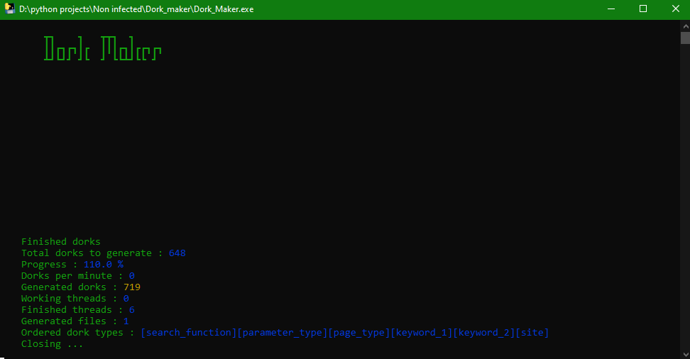

# Dork_Maker
```
┳┓    ┓   ┳┳┓  ┓     
┃┃┏┓┏┓┃┏  ┃┃┃┏┓┃┏┏┓┏┓
┻┛┗┛┛ ┛┗  ┛ ┗┗┻┛┗┗ ┛ 
```
## Overview

Dork_Maker is a tool designed to generate custom dorks based on a combination of user-provided files. This script allows users to specify the order of dork types, manage multi-threaded generation, and provides real-time progress tracking with a visual representation in the terminal.

## Features

- **Custom Dork Generation:** Generate dorks based on files provided by the user, with the ability to specify the order of the dork components.
- **Multi-threaded Processing:** Efficiently generate large numbers of dorks using multiple threads.
- **Real-Time Progress Tracking:** Track the progress of dork generation, including percentage completion, dorks per minute (DPM), and the number of finished threads.

## Files

- **Dork_Maker.py:** The main Python script that handles dork generation.
- **Dork_Maker.exe:** A precompiled executable version of the script, available in the `Dork_Maker_x64.zip` archive.
- **requirements.txt:** Contains the necessary dependencies for running the Python script.

## Requirements

Before running the Python script, ensure that you have all the required dependencies installed. You can install them using the following command:

```bash
git clone https://github.com/AbidAbed/Dork-Maker.git
cd Dork-Maker
pip install -r requirements.txt
```

## Usage

### Running the Script

To start generating dorks, run the `Dork_Maker.py` script using Python:

```bash
python Dork_Maker.py
```

Alternatively, you can run the precompiled executable:

```bash
1. Extract Dork_Maker_x64.zip
2. Run Dork_Maker.exe
```

### Input

When you run the script, you will be prompted to enter the order of dork types and provide the paths to the corresponding files. The tool supports six dork types:

- `search_function`
- `parameter_type`
- `page_type`
- `keyword_1`
- `keyword_2`
- `site`

You must specify the order in which these types will be used to generate dorks. For example:

```text
> Example input: [search_function][keyword_1][page_type][parameter_type][keyword_2][site]
```

After entering the order, provide the paths to the text files containing the respective dork components. The script will then generate all the combinations dorks in the specified order in the `result` folder **MUST NOT BE DELETED**.

### Example

Let's say you want to generate dorks with the following order:

```text
[search_function][keyword_1][page_type][parameter_type][keyword_2][site]
```

If the paths to your files are:

- `C:\dorks\search_function.txt`
- `C:\dorks\keyword_1.txt`
- `C:\dorks\page_type.txt`
- `C:\dorks\parameter_type.txt`
- `C:\dorks\keyword_2.txt`
- `C:\dorks\site.txt`

You would input the paths as prompted:

```text
> Enter the path for the search_function file: C:\dorks\search_function.txt
> Enter the path for the keyword_1 file: C:\dorks\keyword_1.txt
> Enter the path for the page_type file: C:\dorks\page_type.txt
> Enter the path for the parameter_type file: C:\dorks\parameter_type.txt
> Enter the path for the keyword_2 file: C:\dorks\keyword_2.txt
> Enter the path for the site file: C:\dorks\site.txt
```

### Multi-Threading

You can specify the number of threads to be used for generating dorks. This helps in speeding up the process by distributing the workload across multiple threads.

For example, to use 4 threads:

```text
> Enter the number of threads: 4
```

### Output

The generated dorks will be saved in the `./result/` directory. The files will be named `Dorks_0.txt`, `Dorks_1.txt`, etc., depending on the number of dorks generated.

## Important Notes

- **File Structure:** The provided text files must contain valid dork components, one per line.
- **Thread Management:** The script automatically manages thread lifecycles and ensures that the workload is evenly distributed.
- **Error Handling:** The script includes basic error handling for file paths and user inputs. If any issues arise, the process will be aborted with an appropriate error message.

## Example Directory Structure

```plaintext
/Dork-Maker
│
├── sf.txt
├── pt.txt
├── pe.txt
├── kw1.txt
├── kw2.txt
├── site.txt
│ 
├── result/
│   ├── Dorks_0.txt
│   ├── Dorks_1.txt
│   └── ...
│
├── public_urls_filterer.py
├── Dork_Maker_x64.zip
└── requirements.txt
```

## License

This project is licensed under the MIT License. See the `LICENSE` file for more details.

## Contributing

Contributions are welcome! If you encounter any issues or have suggestions for improvements, feel free to open an issue or submit a pull request.

## Acknowledgments

Special thanks to all contributors and the open-source community for their support.

## Example running

<p align="center">
  
</p>